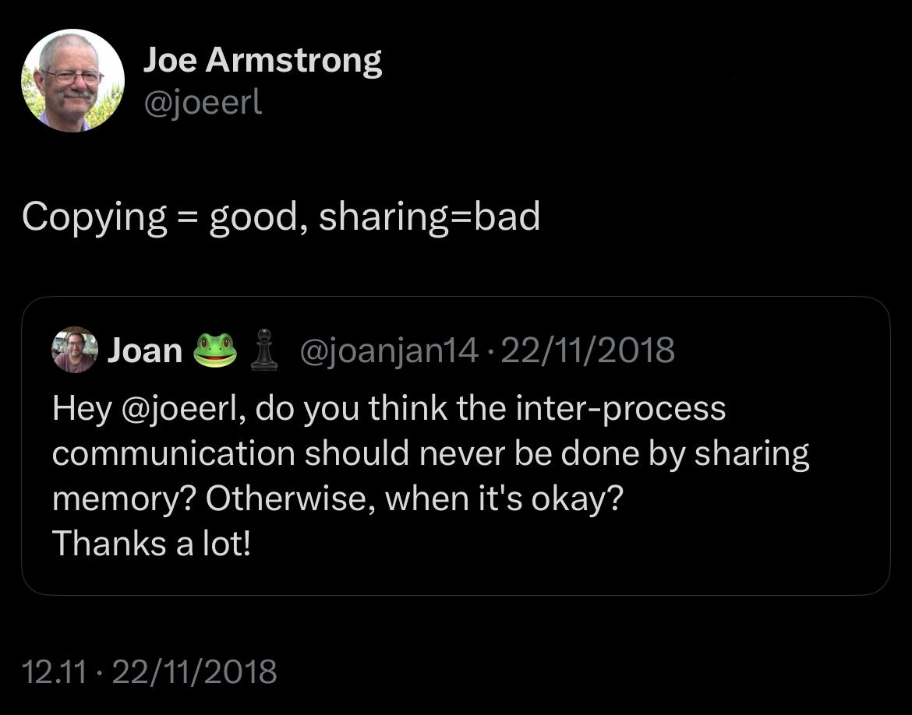

# bank_app
This is a toy bank app that implements the Actor Model with Erlang. 

## The Actor Model 
The **actor model** in computer science is a mathematical model of concurrent computation that treats an actor as the basic building block of concurrent computation. In response to a message it receives, an actor can: 
* make local decisions 
* create more actors
* send more messages
* determine how to respond to the next message received. 
  
Actors may modify their own private state, but can only affect each other indirectly through messaging.
You can read this and more about it in [here](https://en.wikipedia.org/wiki/Actor_model).

In even simpler terms, by Joe Armstrong, co-designer of the Erlang:

## The mobile_app
This toy mobile app was created to implement a simple case of actor model. It is based on an exercise from the course **Practical Concurrent and Parallel Programming** from the **IT University of Copenhagen**. Special thanks to the great professor Raúl Pardo Jimenez. 

Each **bank account** is connected to an **account** and each **account** is connected to a **bank**. The owner of the app can only request payments from his own account. 
The **interface** has a method that starts two account, two banks and two mobile apps, and has two functions to generate transactions. Transactions can be done directly using the terminal.

## 🕹️ How to Run
1. Install Erlang https://www.erlang.org/downloads
2. Clone the repo
3. Run `erlc *erl` to compile
4. Run `erl` to start the Erlang shell 
5. Run `interface:start().` to create two mobile apps or create them using the terminal

